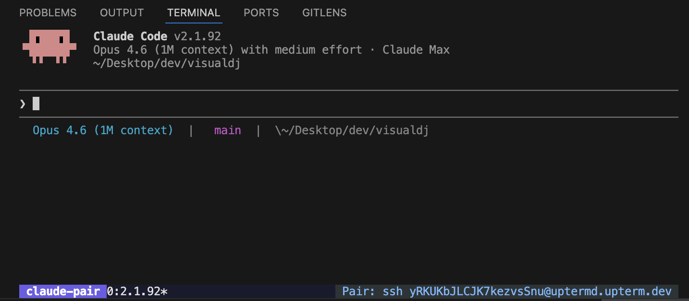

# claude-pair

Share a live Claude Code session with a collaborator over SSH.



## What it does

- Starts a shared tmux session tunneled via upterm so a guest can connect with a single SSH command
- Both host and guest see the same Claude Code terminal in real time
- Optional session recording with asciinema-compatible output

## Quick start

**Host** (starts the session):
```sh
claude-pair host
```

**Guest** (joins with the SSH command the host shares):
```sh
ssh TOKEN@uptermd.upterm.dev
```

## Install

```sh
curl -fsSL https://raw.githubusercontent.com/albertnahas/claude-pair/main/install.sh | sh
```

Or with Go:
```sh
go install github.com/albertnahas/claude-pair/cmd/claude-pair@latest
```

Homebrew tap coming once the project stabilizes.

Prerequisites: [upterm](https://github.com/owenthereal/upterm), [tmux](https://github.com/tmux/tmux), [claude](https://docs.anthropic.com/en/docs/claude-code)

```sh
claude-pair doctor   # verify all dependencies
```

## How it works

`claude-pair host` creates a tmux session, launches Claude Code inside it, and connects upterm to relay it over SSH. The guest runs a plain `ssh` command — no client install required. The join URL is displayed in the host terminal and embedded in the tmux status bar for easy reference.

## Roadmap

See [ROADMAP.md](ROADMAP.md).

## Contributing

See [CONTRIBUTING.md](CONTRIBUTING.md).

---

[](LICENSE)
